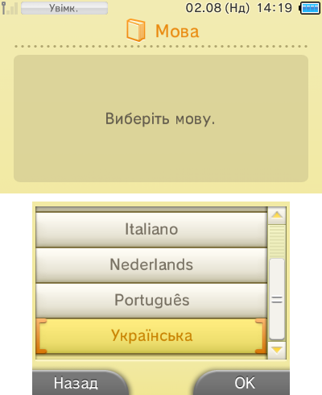
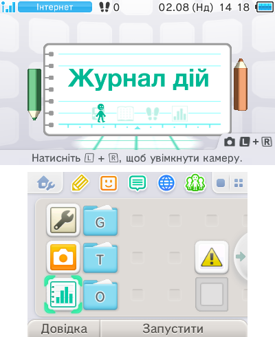
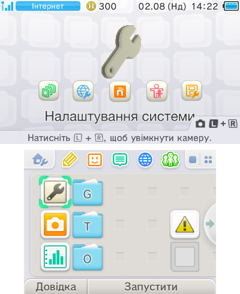
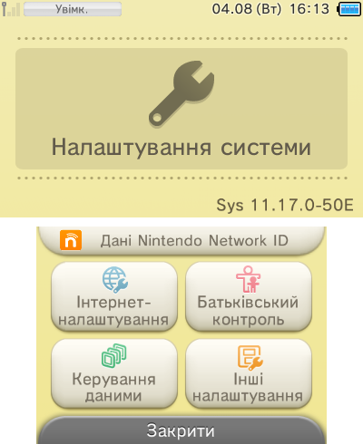
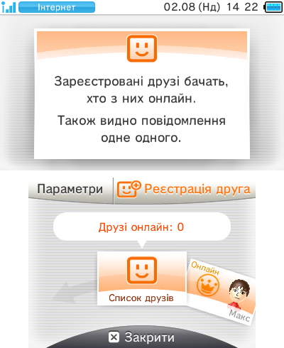
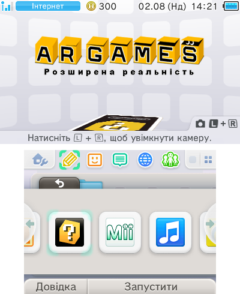
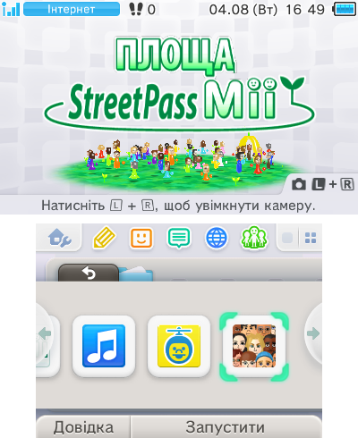
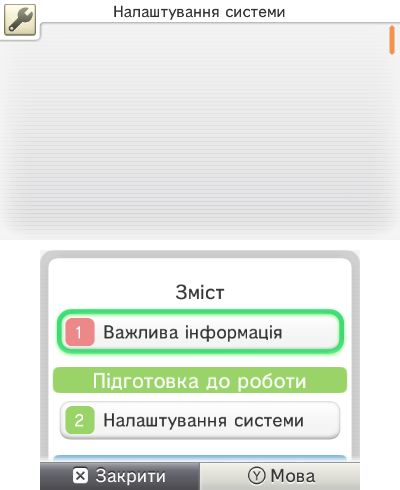
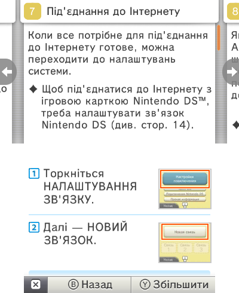

# 3DS UA 🇺🇦

**Українська мова для Nintendo 3DS.** Мод займає місце російської: у списку мов з'являється «Українська», і консоль починає говорити українською. Російська зникає, **англійська та решта мов лишаються на місці**.

Файли самої консолі не змінюються — усе живе на SD-карті. Видалили папки, і все повернулося як було.

**Ціль проєкту — повний українізатор системи:** усе, що видно на екрані, має бути українською. Зараз перекладено **30 частин системи плюс одинадцять електронних довідників**, робота триває.

[Українською](#що-вже-українською) · [In English](#in-english)

---

<table>
<tr>
<td></td>
<td></td>
<td></td>
</tr>
<tr>
<td></td>
<td></td>
<td></td>
</tr>
<tr>
<td></td>
<td></td>
<td></td>
</tr>
</table>

## Що вже українською

Меню HOME (разом з назвами додатків під іконками) · Налаштування системи · Mii Maker · Журнал дій · Електронний посібник · Гра по завантаженню · екранна клавіатура з українською розкладкою · Список друзів · Камера Nintendo 3DS · швидка камера на `L`+`R` · Звук Nintendo 3DS · Здоров'я і безпека · Площа StreetPass Mii · Вибір Mii · Сповіщення (разом з **вбудованими підказками**, що прийшли з першим запуском консолі) · Ігрові записи · екран помилки · Інтернет-браузер · Nintendo eShop · Перенесення даних · Оглядач Nintendo Zone · Face Raiders · AR Games · Налаштування amiibo · аплет покупок і оновлень eShop · 3DS Memo · аплет Circle Pad Pro · Miiverse · публікація в Miiverse · **тексти помилок системи** (усі 259 повідомлень) · список країн і регіонів у налаштуваннях профілю та на Карті StreetPass (усі 67 країн і 83 області коду 100) · **електронні довідники** одинадцяти додатків: Інтернет-браузера, Налаштувань системи, Журналу дій, Гри по завантаженню, Камери, Звуку, Mii Maker, Площі StreetPass Mii, Nintendo eShop, Face Raiders та AR Games.

## Що потрібно

- Nintendo 3DS / 2DS / New 3DS **європейського (EUR) регіону**
- встановлена **Luma3DS** — кастомна прошивка
- SD-карта

Немає Luma3DS? Спершу пройдіть [3ds.hacks.guide](https://3ds.hacks.guide/) — без неї мод не працює.

## Встановлення

**1. Скопіюйте файли на SD-карту**

Візьміть `3ds-ua-<версія>.zip` з [Releases](../../releases). Вимкніть консоль, вставте SD-карту в комп'ютер, розпакуйте архів і скопіюйте папку `luma` в корінь картки — туди, де вже є папка `luma`. Комп'ютер спитає, чи об'єднати папки — погодьтеся.

Поверніть картку в консоль.

**2. Увімкніть патчі в Luma**

Натисніть і **тримайте SELECT**, тоді увімкніть консоль — з'явиться синє меню.

Знайдіть рядок **`Enable game patching`** (сьомий згори), натисніть **A**, щоб навпроти з'явилося `(x)`. Натисніть **START** — консоль збережеться й перезавантажиться.

**3. Виберіть українську**

`Налаштування системи` → `Інші налаштування` → `Мова` → **Українська** → `OK`.

Це той пункт, де раніше було «Русский». Він завжди підписаний «Українська», тож ви побачите його навіть тоді, коли консоль поки що англійською.

Консоль перезавантажиться сама. Готово.

## Як видалити

Будь-який спосіб:

1. **Змінити мову консолі** на будь-яку іншу — переклад просто не застосується.
2. **Видалити папки мода** з `SD:/luma/titles/`.
3. **Вимкнути `Enable game patching`** у меню Luma (це вимкне й інші моди).

Системні файли не змінювалися, тому видалення нічого не ламає.

**Один виняток.** Вбудовані підказки у Сповіщеннях консоль колись скопіювала собі в NAND, і файлами на SD-карті їх уже не дістати — мод переписує їх у самій базі. Після видалення мода вони лишаться українськими (не зіпсованими — просто українськими). Якщо цього не хочеться, видаліть `SD:/luma/titles/0004003000009802/code.ips` **до** першого запуску з модом: тоді підказки лишаться російськими, разом з назвами додатків і банерами, які той самий файл перекладає.

## Чого поки що немає

- **України в списку країн немає.** У таблиці кодів країн Nintendo її немає взагалі: європейський блок суцільний, без пропусків, `…99 Румунія, 100 Росія, 101 Сербія…`. Код країни — системна величина, від якої залежать NNID, eShop і вікові рейтинги, і нового рядка в таблицю не вставити. Раніше мод перейменовував код `100` на «Україна» разом з його областями — але **назву за цим кодом кожен читає своєю таблицею**, тому інші гравці в онлайні, NNID, eShop і StreetPass однаково бачили «Росія», а українська область показувалася їм російською, що стоїть під тим самим номером. Тепер список показує те, що консоль справді повідомляє: код `100` — це `росія (болота)` з її ж 83 областями, усе з малої літери. Плутанини регіонів в онлайні більше немає.

  **Мова й країна в 3DS ніяк не пов'язані:** переклад стоїть на мовному слоті, тому інтерфейс лишиться повністю українським з будь-якою країною в профілі — ставте будь-яку.
- **Українських `і ї є ґ`.** У шрифті самої консолі їх немає, тому мод показує візуально близькі `i ï ε г`. Замінити шрифт можна лише правкою системних файлів — а проєкт цього свідомо не робить.
- **Справжніх літер з клавіатури.** Розкладка українська (`ы`→`і`, `ъ`→`ї`, `э`→`є`, а на місці `ё` тепер апостроф), але вводяться ті самі символи-замінники.
- **Електронних довідників решти додатків.** Переглядач бере довідник кожного додатка окремо, тож кожен треба здампити з вашої консолі й перекласти. Готові одинадцять — Інтернет-браузера, Налаштувань системи, Журналу дій, Гри по завантаженню, Камери, Звуку, Mii Maker, Площі StreetPass Mii, Nintendo eShop, Face Raiders та AR Games, усі повністю; решта показує той самий довідник, що й раніше. Більше в цю збірку й не влізе: таблиця шляхів переглядача та таблиця назв додатків займають 977 із 1064 байтів вільного місця в його коді. Довідники ігор належать іграм, а не системі, тож лишаються як є.
- **Назв додатків у Керуванні даними, eShop, Перенесенні даних та Ігрових записах** — там вони поки що російською.
- **Збірки для консолей USA та JPN.** Російського мовного слота в них немає взагалі, тож потрібна окрема збірка — напишіть в Issues, якщо вона вам потрібна.

## Якщо щось пішло не так

| Що бачите | Що робити |
|---|---|
| Інтерфейс лишився російським | Не увімкнено `Enable game patching`. Ця галочка злітає після оновлення Luma — поставте знову. |
| Російською, а галочка стоїть | Перевірте шлях: має бути `luma/titles/…`, а не `luma/luma/titles/…`. |
| У списку мов немає «Українська» | Архів скопіювався не повністю, або консоль не EUR-регіону. |
| Частина тексту не українською | Так і має бути: технічні написи (`OK`, `Miiverse`, формати дат) лишені як є. |
| У списку країн немає України | Свого коду в системі Україна не має — [чому](#чого-поки-що-немає). Ставте будь-яку країну, інтерфейс лишиться українським. |
| `An exception occurred` при запуску додатка | Перейменуйте `SD:/luma/titles/<номер>/romfs` цього додатка на `_romfs` і перезавантажте — він запуститься без перекладу. І [напишіть в Issues](../../issues) з фото екрана. |
| Меню HOME не завантажується | Видаліть `SD:/luma/titles/0004003000009802/code.ips`. Не допомогло — усю папку `0004003000009802`. |
| Якийсь додаток крешить після встановлення | У вас старіша його версія. Видаліть папку цього додатка з `SD:/luma/titles/` — решта перекладу працюватиме. Номери папок є в [технічному описі](docs/internals.md). |

Порожні квадрати замість літер, обрізані чи накладені написи — це баг. [Відкрийте Issue](../../issues) з фото екрана.

## Як допомогти

- **Знайшли помилку чи кривий переклад** — [відкрийте Issue](../../issues/new/choose). Там два шаблони: «Баг на консолі» і «Кривий переклад» — вони самі спитають усе потрібне. Фото екрана допомагає найбільше.
- **Хочете виправити самі** — правте поле `ua` у `src/strings/<додаток>/*.json` (поруч у полі `en` — оригінал) і надсилайте Pull Request. Терміни звіряйте з [глосарієм](src/glossary.md), а перед PR запустіть `make validate`: воно перевірить, що текст влазить на екран і не містить символів, яких у шрифті немає.
- **Знаєте, чого ще бракує** — [напишіть в Issues](../../issues). Там же видно, що вже взяте в роботу.

## Технічні деталі

Як воно влаштовано: за що відповідає кожна папка, чому частині додатків потрібна правка коду, звідки беруться назви під іконками і як добудовано шрифт верхнього рядка — **[docs/internals.md](docs/internals.md)**.

Зібрати мод самому зі своїх дампів — **[docs/dumping.md](docs/dumping.md)**.

## Ліцензія

Код інструментів і текст перекладу — MIT. Файлів Nintendo в репозиторії немає; збірка потребує дампу з власної консолі. Проєкт неофіційний, з Nintendo не пов'язаний.

---

## In English

**Ukrainian system language for the Nintendo 3DS.** The mod takes the place of Russian: «Українська» appears in the language list and the console starts speaking Ukrainian. Russian disappears, **English and every other language stay untouched.**

Nothing on the console itself is modified — it all lives on the SD card. Delete the folders and everything is back to stock.

**The goal is a complete Ukrainian localisation** of everything visible on screen. **30 parts of the system plus eleven electronic manuals** are done so far; work continues.

### Already in Ukrainian

HOME Menu (including the application names under the icons) · System Settings · Mii Maker · Activity Log · Instruction Manual · Download Play · Software Keyboard with a Ukrainian layout · Friend List · Camera · the quick camera on `L`+`R` · Sound · Health & Safety · StreetPass Mii Plaza · Mii Selector · Notifications (including the **built-in tips** that arrived with the console's first boot) · Game Notes · error applet · Internet Browser · Nintendo eShop · System Transfer · Nintendo Zone · Face Raiders · AR Games · amiibo Settings · the eShop purchase/update applet · 3DS Memo · the Circle Pad Pro applet · Miiverse · Miiverse posting · the **system error messages** (all 259 of them) · the country and region lists in the profile settings and on the StreetPass Map (all 67 countries and the 83 regions of code 100) · the **electronic manuals** of eleven titles, in full: Internet Browser, System Settings, Activity Log, Download Play, Camera, Sound, Mii Maker, StreetPass Mii Plaza, Nintendo eShop, Face Raiders and AR Games.

### Requirements

- a Nintendo 3DS / 2DS / New 3DS of the **European (EUR) region**
- **Luma3DS** custom firmware installed
- an SD card

No Luma3DS yet? Follow [3ds.hacks.guide](https://3ds.hacks.guide/) first — the mod does nothing without it.

### Installation

**1. Copy the files onto the SD card**

Grab `3ds-ua-<version>.zip` from [Releases](../../releases). Power the console off, put the SD card in your computer, unpack the archive and copy the `luma` folder into the card's root — where a `luma` folder already exists. Agree when your computer offers to merge them.

Put the card back.

**2. Enable patching in Luma**

Hold **SELECT** and power the console on — the blue Luma menu appears.

Select **`Enable game patching`** (7th line), press **A** so it reads `(x)`, then press **START** to save and reboot.

**3. Pick Ukrainian**

`System Settings` → `Other Settings` → `Language` → **Українська** → `OK`.

That is the entry that used to read «Русский». It is labelled «Українська» in every language, so you can find it while the console still runs in English.

The console reboots itself. Done.

### Uninstalling

Any of these:

1. **Switch the console language** to anything else — the translation simply won't apply.
2. **Delete the mod folders** from `SD:/luma/titles/`.
3. **Turn `Enable game patching` off** in the Luma menu (this disables other mods too).

Nothing in the system was modified, so removal cannot break anything.

**One exception.** The built-in Notification tips were copied into NAND by the console long ago, and no file on the SD card can reach them — the mod rewrites them inside that database. After you remove the mod they stay Ukrainian (not corrupted — simply Ukrainian). If you'd rather they didn't, delete `SD:/luma/titles/0004003000009802/code.ips` **before** the first boot with the mod: the tips then stay Russian, along with the application names and banners that same file translates.

### Known limits

- **Ukraine is not in the country list.** Nintendo's country table has no Ukraine at all: the European block runs unbroken, `…99 Romania, 100 Russia, 101 Serbia…`. The country code is a system-wide value that NNID, the eShop and age ratings depend on, and no new row fits in the table. The mod used to rename code `100` to «Україна» along with its regions — but **every other machine resolves that code with its own table**, so other players online, NNID, the eShop and StreetPass saw Russia anyway, and a Ukrainian oblast reached them as the Russian one sharing its index. The list now says what the console actually reports: code `100` is `росія (болота)` with its own 83 oblasts, lowercase throughout. No more region mix-ups online.

  **Language and country are unrelated on the 3DS:** the translation hangs off the language slot, so the interface stays fully Ukrainian whatever country your profile says — pick any.
- **The Ukrainian letters `і ї є ґ`** are not in the console's font, so the mod shows the visually closest `i ï ε г`. Replacing the font would mean modifying the system itself, which this project deliberately avoids.
- **Typing them.** The keyboard layout is Ukrainian (`ы`→`і`, `ъ`→`ї`, `э`→`є`, `ё`→apostrophe), but it types those same substitute characters.
- **The electronic manuals of the remaining titles.** The viewer reads each title's own manual, and each one has to be dumped off your console and translated separately. 1.0.0 ships eleven in full; every other title shows the manual it always did. The ceiling is now space, not text: the viewer's path table and its SMDH name table share one 1064-byte window of `.rodata` padding, and eleven titles use 977 of it — a twelfth needs new space first. A game's manual belongs to the game, not to the system, so those stay as they are.
- **Application names in Data Management, the eShop, System Transfer and Game Notes** are still Russian.
- **USA and JPN consoles** have no Russian language slot at all and need a separate build. Open an Issue if you want one.

### If something goes wrong

| Symptom | Fix |
|---|---|
| Interface is still Russian | `Enable game patching` is off. It resets when you update Luma — turn it back on. |
| Still Russian, the option is on | Check the path: `luma/titles/…`, not `luma/luma/titles/…`. |
| No «Українська» in the language list | The archive was not copied fully, or the console is not EUR. |
| Some text is not Ukrainian | Expected: technical strings (`OK`, `Miiverse`, date formats) are left as they are. |
| Ukraine is missing from the country list | The system has no country code for it, see [Known limits](#known-limits). Pick any country; the interface stays Ukrainian. |
| `An exception occurred` when opening an app | Rename that app's `SD:/luma/titles/<id>/romfs` to `_romfs` and reboot — it will start untranslated. Please [open an Issue](../../issues) with a photo. |
| HOME Menu won't boot | Delete `SD:/luma/titles/0004003000009802/code.ips`. If that doesn't help, delete the whole `0004003000009802` folder. |
| An app crashes after installing | You have an older build of it. Delete that app's folder from `SD:/luma/titles/` — the rest keeps working. Folder numbers are in the [technical write-up](docs/internals.en.md). |

Empty boxes instead of letters, clipped or overlapping text — that's a bug. [Open an Issue](../../issues) with a photo.

### Contributing

- **Found a mistake or an awkward wording** — [open an Issue](../../issues/new/choose). Two templates are there — «Баг на консолі» (a bug) and «Кривий переклад» (a wording problem) — and they ask for everything needed. A photo of the screen helps most.
- **Want to fix it yourself** — edit the `ua` field in `src/strings/<app>/*.json` (`en` next to it is the original) and send a Pull Request. Check terms against the [glossary](src/glossary.en.md), and run `make validate` first: it checks that the text fits on screen and uses no characters the font lacks.
- **Know what else is missing** — [tell us in an Issue](../../issues).

### Technical details

How it works — what each folder does, why some titles need a code patch, where the names under the icons come from, how the top-bar font was extended: **[docs/internals.en.md](docs/internals.en.md)**.

Building the mod from your own dumps: **[docs/dumping.en.md](docs/dumping.en.md)**.

### Licence

Tooling code and translation text are MIT. No Nintendo files are in this repository; building requires a dump from your own console. Unofficial project, not affiliated with Nintendo.
